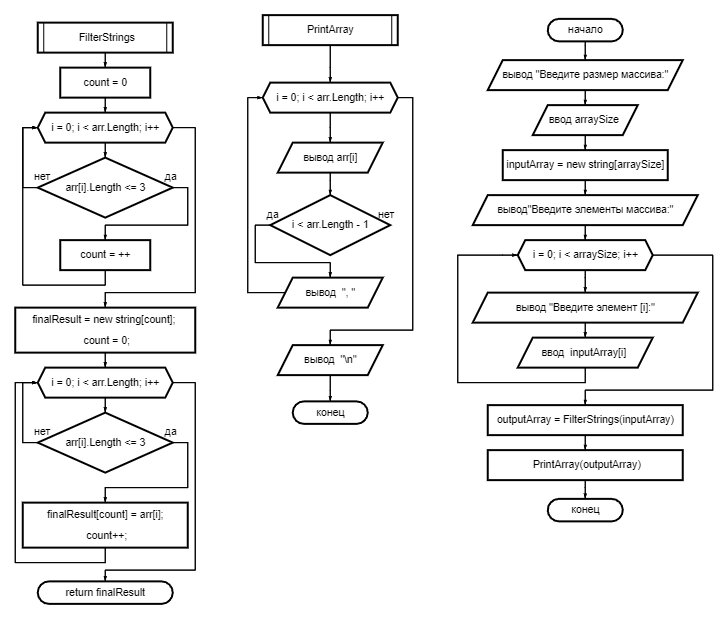

 # Задача 
 **Написать программу, которая из имеющегося массива строк формирует новый массив из строк, длина которых меньше, либо равна 3 символам.**

 * *Создадим метод - FilterStrings, который будет искать в массиве строчки длинной в 3 символа, считать их, потом создавать новый массив по количеству найденых строчек и заполнять его этими строками.*

* *создадим метод вывода на экран созданного массива со строками не длинее 3 символов.*

* * Напишем программу которая на вход будет принимать массив со строками и используя выше созданные методы выдавать результат.

* Программа работает согласно блок-схеме:
